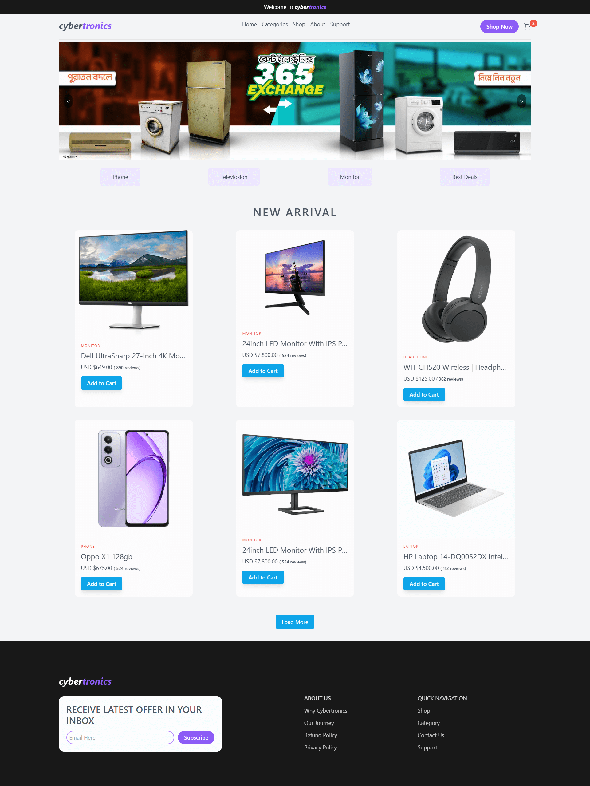

# Cybertronics

A parcel focused project that displays a product catalog with the ability to view product details and simulate data interactions using json-server and Parcel.


## Features

- Display products from a local JSON file.
- Dynamic product detail modal.
- FJSON Server integration for backend data simulation.
- Parcel bundler for efficient development and build processes.


## Tech Stack

**Client:** Html, TailwindCSS, Parcel

**Server:** Json-Server


## Demo 




## Getting Started

To Started this project on your system.

Prerequisites
- Node.js installed.
- A package manager like npm.

### Installation

#### 1.Clone this repository:
```bash
  git clone <repository-url>
```

#### 2.Navigate to the project directory:
```bash
  cd cybertronics
```


#### 3.Install dependencies:
```bash
  npm install
```

## Available Scripts


### Start the Application
Run the json-server and Parcel development server concurrently:
```bash
  npm run build
```


#### Project Structure
```bash
  .
├── db.json               # JSON file for mock API data
├── src/
│   ├── index.html        # Entry HTML file
│   ├── styles.css        # Custom styles
│   ├── app.js            # Main JavaScript logic
├── package.json          # Project metadata and scripts

```


## Enjoy the project.